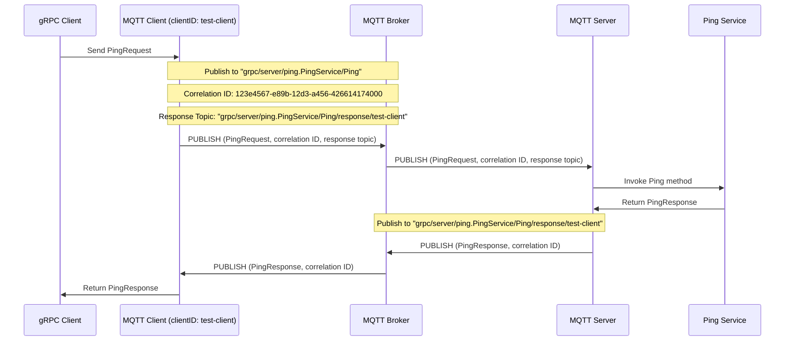

# gRPC over MQTT

Just playing around with the idea of using MQTT5 as a transport protocol for gRPC to avoid a lot of network complexity.

MQTT5 introduces nifty concepts such as correlation data and response topics to accommodate such use cases.

## Example

This is an example of how the flow of MQTT messages might look like using this transport.

The example refers to the [ping_service.proto](src/intTest/proto/ping_service.proto) which is used in integration tests.

